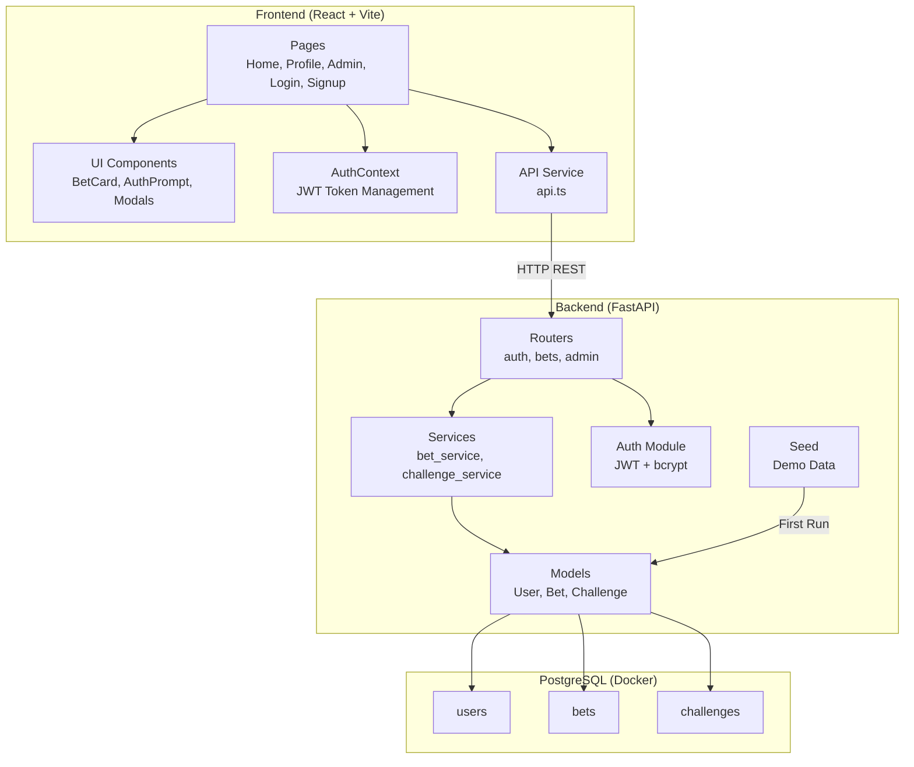
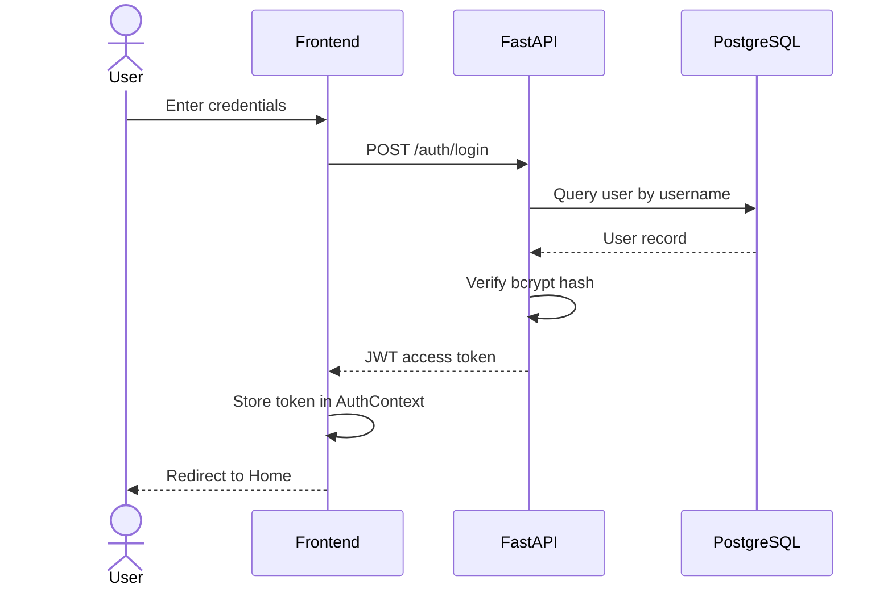
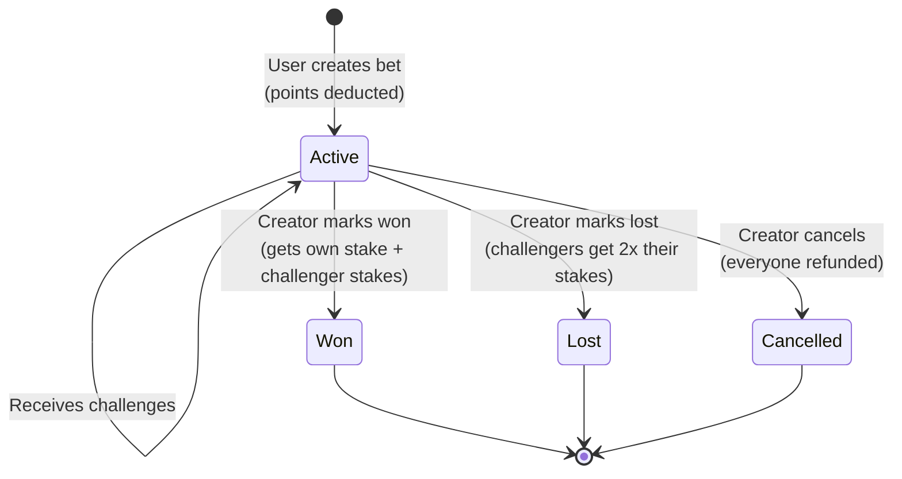
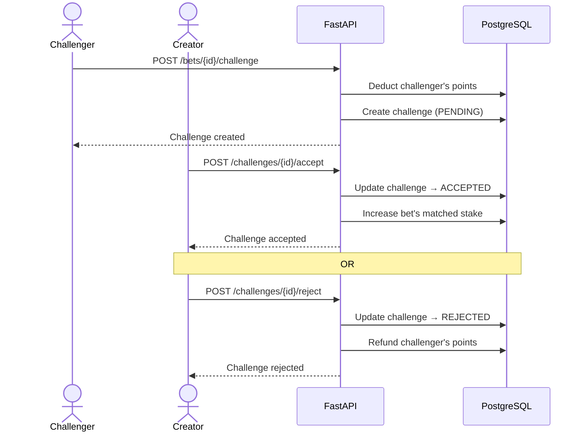
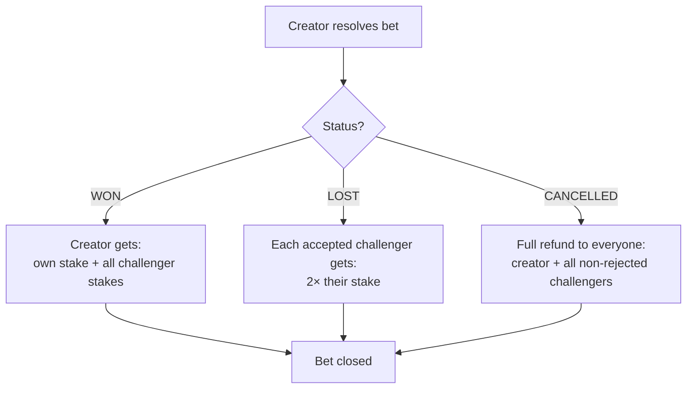
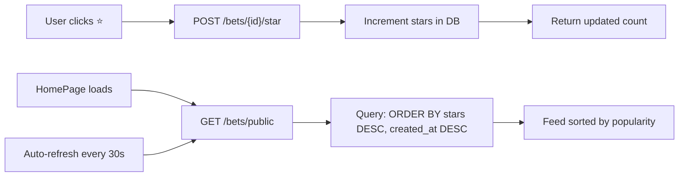
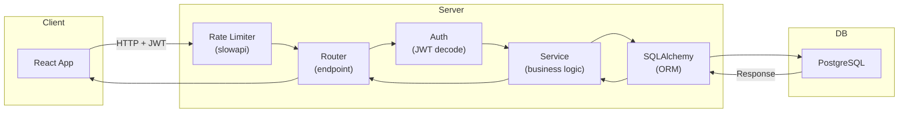

# Project BAY — Flowchart

## System Architecture

---

## User Authentication Flow

---

## Bet Lifecycle

---

## Challenge Flow

---

## Bet Resolution & Point Distribution

---

## Star & Feed System

---

## Request Flow (Full Stack)

