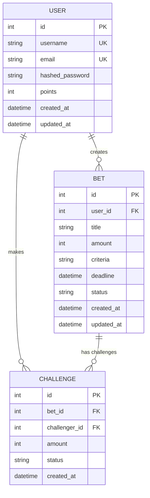
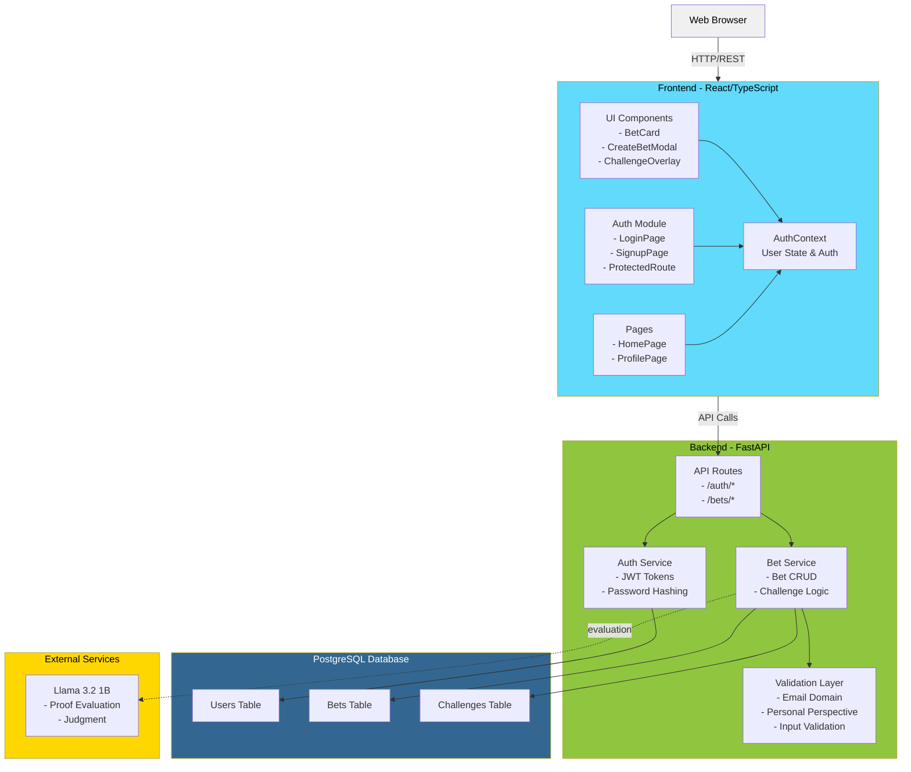

# Project BAY

Project BAY is a social challenge platform where users stake personal commitments against friends using their points.

## Demo

-- add screenshot here

## Tech stack

```
Frontend: React, Typescript, Vite
Backend:  FastAPI, Python v3.14
Database: Postgres (via Docker)
LLM:      Llama v3.2 1b (via Docker)
```

## Setup

### Install Dependencies

```bash
cd frontend && npm install
```

```bash
cd backend
python -m venv venv
source venv/scripts/activate
docker-compose up -d
pip install -r requirements.txt
```

## Running locally

1. Start the backend server:
   ```bash
   uvicorn app.main:app
   ```

2. Start the frontend (in a separate terminal):
   ```bash
   npm run dev
   ```

## To do

- [x] add cancel button
- [ ] add star button to card
- [ ] sort the feed by stars
- [ ] friends network
- [ ] proof submission to AI
- [ ] configuring AI as judge
- [ ] win/loss decision
- [x] credit/refund points
- [ ] Create an admin page
- [x] profile page
- [x] add deadline to card
- [x] Search functionality
- [x] authentication (login/signup)
- [X] Abuse prevention (not rubust)

## Project Structure

```
project-bay/
├── backend/
│   ├── app/
│   │   ├── __init__.py
│   │   ├── auth.py                # JWT, password hashing, auth dependencies
│   │   ├── config.py              # Configuration & settings
│   │   ├── database.py            # DB engine & session
│   │   ├── exceptions.py          # Custom exceptions
│   │   ├── logging_config.py      # Logging setup
│   │   ├── main.py                # FastAPI app entrypoint
│   │   ├── models.py              # SQLAlchemy models
│   │   ├── schemas.py             # Pydantic request/response schemas
│   │   ├── routers/               # FastAPI HTTP layer
│   │   │   ├── __init__.py
│   │   │   ├── auth.py            # Authentication endpoints
│   │   │   └── bets/              # Bet management endpoints
│   │   │       ├── __init__.py
│   │   │       ├── bet_crud.py    # Bet CRUD operations
│   │   │       ├── challenges.py  # Challenge logic
│   │   │       └── resolution.py  # Bet resolution logic
│   │   ├── services/              # Business logic layer
│   │   │   ├── __init__.py
│   │   │   ├── bet_service.py     # Bet business logic
│   │   │   └── challenge_service.py # Challenge business logic
│   │   └── utils/                 # Validation utilities
│   │       └── validation.py      # Input & business rule validation
│   ├── initdb/                    # Test Database initialization script
│   │   └── init_test_db.sql
│   ├── tests/                     # Unit & integration tests
│   │   ├── conftest.py
│   │   ├── test_auth.py
│   │   └── test_bets.py
│   ├── docker-compose.yml         # Docker services configuration
│   ├── requirements.txt           # Python dependencies
│   ├── run.py                     # Application runner
│   └── .env.example               # Environment variables
│
├── frontend/
│   ├── src/
│   │   ├── components/            # Reusable UI components
│   │   │   ├── AuthPrompt.tsx     # Authentication prompts
│   │   │   ├── BetCard.tsx        # Bet display card
│   │   │   ├── ChallengeOverlay.tsx # Challenge interaction overlay
│   │   │   ├── CreateBetModal.tsx # Bet creation modal
│   │   │   └── ProtectedRoute.tsx # Route protection wrapper
│   │   ├── contexts/              # React context providers
│   │   │   └── AuthContext.tsx    # Global authentication state
│   │   ├── pages/                 # Route-level pages
│   │   │   ├── HomePage.tsx       # Main feed & bets display
│   │   │   ├── LoginPage.tsx      # Login page
│   │   │   ├── ProfilePage.tsx    # User profile page
│   │   │   └── SignupPage.tsx     # Registration page
│   │   ├── services/              # API clients & frontend business logic
│   │   │   └── api.ts             # API request handlers
│   │   ├── utils/                 # Utility functions
│   │   │   └── avatar.ts          # Avatar generation utilities
│   │   ├── App.tsx                # Root application component
│   │   ├── index.css              # Global styles
│   │   ├── main.tsx               # React entry point
│   │   └── types.ts               # TypeScript type definitions
│   ├── img/                       # Static assets
│   │   └── site.webmanifest       # PWA manifest
│   ├── index.html                 # HTML template
│   ├── package.json               # NPM dependencies & scripts
│   ├── postcss.config.js          # PostCSS configuration
│   ├── tailwind.config.js         # Tailwind CSS configuration
│   ├── tsconfig.json              # TypeScript configuration
│   ├── tsconfig.node.json         # TypeScript node configuration
│   ├── vite.config.ts             # Vite bundler configuration
│   └── .env.example               # Environment variable template
│
├── LICENSE
└── README.md
```

<sub><em>view in browser</em></sub>

## Database Architecture (ER Diagram)



## Webapp Architecture



## Bottlenecks

- Single API instance (no load balancing)
- Single DB instance
    ```text
        Current: SQLAlchemy creates new connection per request
        Impact: Connection exhaustion at ~50-100 concurrent users
        Solution: Add database connection pooling, will support 3x more.
    ```
- No response caching
    ```text
    Current: Every request hits the database
    Impact: Redundant queries, slower response times
    Solution: Cache user profiles, bet listings, in Redis. It'll reduce db load by 40%.
    ```
- Llama - too slow
    ```text
        Current: Synchronous blocking calls (2-10 seconds)
        Impact: Request hangs while waiting for LLM evaluation
        Solution: Add calls to queue instead of blocking
    ```
- Single server architecture
    ```text
    Current: No horizontal scaling
    Impact: Cannot distribute load across multiple instances
    ```


## Future Additions

- [ ] Dark mode
- [ ] Recommendation system
- [ ] Vibe coded ios app
- [ ] Adding web3 wallet to profile