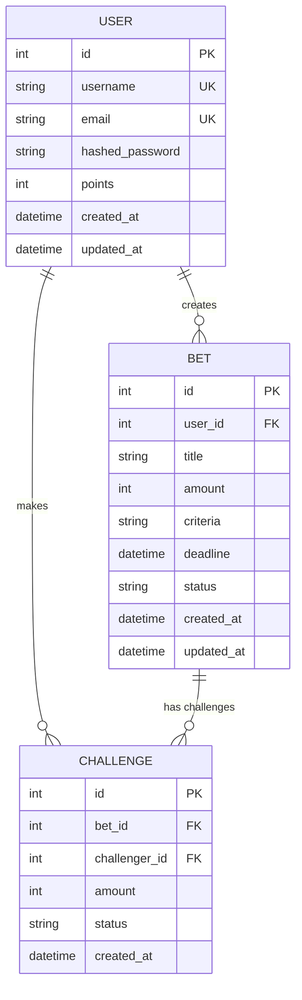
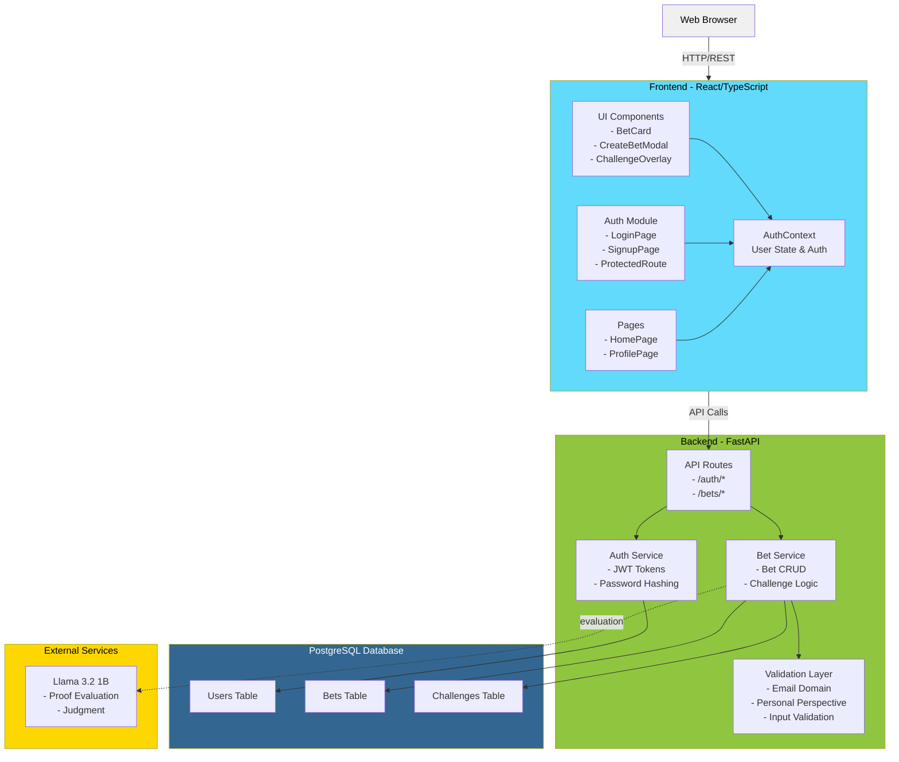

# Project BAY

Project BAY is a social challenge platform where users stake personal commitments against friends using their points.

## Demo

-- add screenshot here

## Tech stack

```
Frontend: React, Typescript, Vite
Backend:  FastAPI, Python v3.14
Database: Postgres (via Docker)
LLM:      Llama v3.2 1b (via Docker)
```

## Setup

### Install Dependencies

```bash
cd frontend && npm install
```

```bash
cd backend
python -m venv venv
source venv/scripts/activate
docker-compose up -d
pip install -r requirements.txt
```

## API Documentation

Once the server is running, you can access:
- **Interactive API Docs**: http://localhost:8000/docs (Swagger UI)
- **Alternative Docs**: http://localhost:8000/redoc (ReDoc)

## Running locally

1. Start the backend server:
   ```bash
   cd backend && uvicorn app.main:app
   ```

2. Start the frontend (in a separate terminal):
   ```bash
   cd frontend && npm run dev
   ```

3. The frontend will be available at `http://localhost:5173` and will automatically connect to the backend API at `http://localhost:8000`.


## To do

- [ ] add cancel button
- [ ] add star button to card
- [ ] sort the feed by stars
- [ ] friends network
- [ ] proof submission to AI
- [ ] configuring AI as judge
- [ ] win/loss decision
- [ ] credit/refund points
- [ ] Create an admin page
- [x] profile page
- [x] add deadline to card
- [x] Search functionality
- [x] authentication (login/signup)
- [X] Abuse prevention (not rubust)

## Project Structure

```
project-bay/
├── backend/
│   ├── app/
│   │   ├── auth.py                # JWT, password hashing, auth dependencies
│   │   ├── config.py              # Configuration & settings
│   │   ├── database.py            # DB engine & session
│   │   ├── exceptions.py          # Custom exceptions
│   │   ├── logging_config.py      # Logging setup
│   │   ├── main.py                # FastAPI app entrypoint
│   │   ├── models.py              # SQLAlchemy models
│   │   ├── schemas.py             # Pydantic request/response schemas
│   │   ├── routers/               # FastAPI HTTP layer with Auth and Bet endpoints
│   │   └── utils/                 # Validation utilities
│   ├── initdb/                    # Test Database initialization script
│   ├── tests/                     # Unit & integration tests
│   ├── docker-compose.yml         # Docker services configuration
│   ├── requirements.txt           # Python dependencies
│   └── .env.example               # Environment variables
│   └── run.py                     # Application runner
│
├── frontend/
│   ├── src/
│   │   ├── components/            # Reusable UI components
│   │   │   ├── AuthPrompt.tsx
│   │   │   ├── BetCard.tsx
│   │   │   ├── ChallengeOverlay.tsx
│   │   │   ├── CreateBetModal.tsx
│   │   │   └── ProtectedRoute.tsx
│   │   ├── contexts/              # React context providers
│   │   ├── pages/                 # Route-level pages
│   │   ├── services/              # API clients & frontend business logic
│   │   ├── utils/                 # Fetch avatar
│   │   ├── App.tsx
│   │   ├── index.css
│   │   ├── main.tsx
│   │   └── types.ts
│   ├── .env.example               # contains env variable to API
│   ├── img/                       # Favicon
│   ├── index.html
│   ├── package.json
│   ├── postcss.config.js
│   ├── tailwind.config.js
│   ├── tsconfig.json
│   ├── tsconfig.node.json
│   └── vite.config.ts
│
└── README.md
```

## Database Architecture (ER Diagram)



## Webapp Architecture



## Future Additions

- [ ] Dark mode
- [ ] Recommendation system
- [ ] Adding web3 wallet to profile