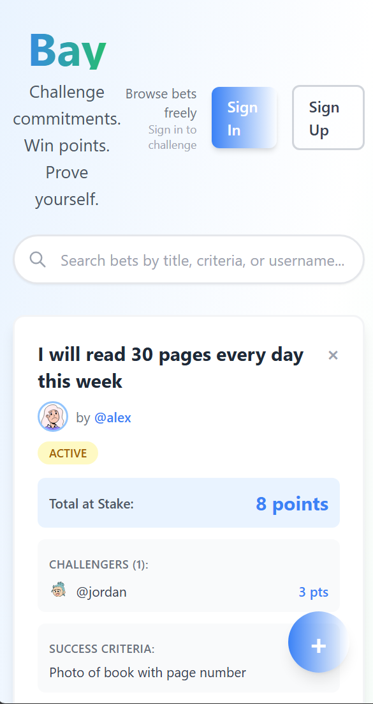

# Project BAY


**Project BAY** is a social challenge platform where users stake personal commitments against friends using a virtual points system. Prove your discipline, challenge your friends, and track your wins.

## Demo

<table>
  <tr>
    <td align="center" width="70%">
      
      <br>Desktop View
    </td>
    <td align="center" width="30%">
      
      <br>Mobile View
    </td>
  </tr>
</table>

---

## Features

- **Personal Commitments** — Set measurable goals (e.g., "Run 5k", "Read 30 pages")
- **Social Challenges** — Friends can bet points that you *won't* follow through
- **Star System** — Community-curated feed sorted by popularity
- **Admin Dashboard** — View all users and bets for platform management
- **User Profiles** — Track wins, losses, and active challenges
- **Validation** — Regex-based commitment validation ensuring quality bets

## Tech Stack

```
Frontend: React, TypeScript, Vite, Tailwind CSS
Backend:  FastAPI, SQLAlchemy, Pydantic
Database: PostgreSQL (via Docker)
Auth:     JWT (OAuth2 password flow)
```

---

## Getting Started

### Prerequisites
- Docker & Docker Compose
- Node.js v18+
- Python 3.12+

### Installation

1. **Clone the repository**
   ```bash
   git clone https://github.com/gv1shnu/project-bay.git
   cd project-bay
   ```

2. **Backend**
   ```bash
   cd backend
   python -m venv venv
   venv\Scripts\activate            # Windows
   source venv/bin/activate       # Mac/Linux

   pip install -r requirements.txt        (production)
   pip install -r requirements-dev.txt    (local)

   docker-compose up -d
   ```

3. **Frontend**
   ```bash
   cd frontend && npm install
   ```

### Running the Application

1. Start the backend server:
   ```bash
   gunicorn -k uvicorn.workers.UvicornWorker -w 4 main:app    (production)
   uvicorn app.main:app --reload                               (local)
   ```

2. Start the frontend (in a separate terminal):
   ```bash
   npm run build    (production)
   npm run dev      (local)
   ```

### Default Credentials (Seed Data)

The application automatically seeds demo data on the first run.

| Username   | Password       |
|------------|----------------|
| **alex**   | `***********`  |
| **jordan** | `***********`  |
| **sam**    | `***********`  |

Admin Dashboard: `/admin`

---

## To Do

- [ ] Friends network
- [X] Proof upload
- [x] add notification icon
- [ ] Configuring POC
- [ ] Win/loss decision
- [ ] Abuse prevention (using LLM)
- [x] Add star button to card
- [x] Sort the feed by stars
- [x] Credit/refund points
- [x] Add cancel button
- [x] Create an admin page
- [x] Profile page
- [x] Add deadline to card
- [x] Search functionality
- [x] Authentication (login/signup)

---

## Bottlenecks

- **Single API Instance** — No load balancing
- **Single Server Architecture** - No horizontal scaling

## Future Additions

- [ ] Dark mode
- [ ] Recommendation system
- [ ] Adding crypto wallet

---

## Contributing

1. Fork the project
2. Create your feature branch (`git checkout -b feature/AmazingFeature`)
3. Commit your changes (`git commit -m 'Add some AmazingFeature'`)
4. Push to the branch (`git push origin feature/AmazingFeature`)
5. Open a Pull Request

## License

Distributed under the MIT License. See `LICENSE` for more information.