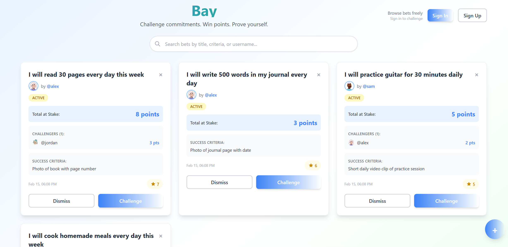
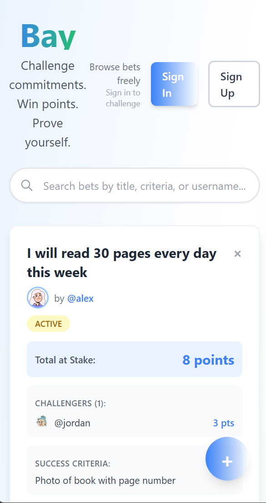

# Project BAY


**Project BAY** is a social challenge platform where users stake personal commitments against friends using a virtual points system. Prove your discipline, challenge your friends, and track your wins.

Points are virtual and have no monetary value — this is a motivation game, not a betting or money app.

Current Status: MVP.

## Demo v1

<table>
  <tr>
    <td align="center" width="70%">
      
      <br>Desktop View
    </td>
    <td align="center" width="30%">
      
      <br>Mobile View
    </td>
  </tr>
</table>

---

## How it works

1. **Create** — You post a personal commitment ("I will run 5km today"), stake some points, and set the deadline and proof criteria.
2. **Challenge** — People who follow you stake points betting you *won't* follow through. Their stakes join the pot. (You can only challenge people you follow.)
3. **Prove** — Before the deadline you upload proof (photo/video + comment).
4. **Verify** — Challengers review the proof:
   - All approve → you win the whole pot.
   - Anyone flags it → it goes to the Tribunal.
5. **Tribunal** — Neutral users act as a jury; the first side to 3 votes decides it. The winning side pays a small court fee to the jurors who called it right.

New users start with 10 points. If a review stalls, the creator wins automatically — funds are never trapped.

## Features

- **Personal Commitments** — Set measurable goals (e.g., "Run 5k", "Read 30 pages")
- **Follow graph** — Follow people to see their activity and challenge them; you can only challenge those you follow
- **Social Challenges** — Followers stake points that you *won't* follow through
- **Proof + Verification** — Upload proof; challengers review, disputes go to a public jury
- **Proportional Payouts** — Challengers win a share of the pot in proportion to their stake
- **AI Moderation** — Bets are checked to be personal, actionable, and safe (not predictions or abuse)
- **Star System** — Community-curated feed sorted by popularity
- **Admin Dashboard** — View all users and bets for platform management
- **User Profiles** — Track wins, losses, and active challenges

## Tech Stack

```
Frontend: React, TypeScript, Vite, Tailwind CSS
Backend:  FastAPI, SQLAlchemy, Pydantic
Database: PostgreSQL (via Docker)
Auth:     JWT (OAuth2 password flow)
```

---

## Getting Started

### Prerequisites
- Docker & Docker Compose
- Node.js v18+
- Python 3.12+

### Installation

1. **Clone the repository**
   ```bash
   git clone https://github.com/gv1shnu/project-bay.git
   cd project-bay
   ```

2. **Backend**
   ```bash
   cd backend
   python -m venv venv
   venv\Scripts\activate            # Windows
   source venv/bin/activate       # Mac/Linux

   pip install -r requirements.txt        (production)
   pip install -r requirements-dev.txt    (local)

   docker-compose up -d
   ```

3. **Frontend**
   ```bash
   cd frontend && npm install
   ```

### Running the Application

1. Start the backend server:
   ```bash
   gunicorn -k uvicorn.workers.UvicornWorker -w 4 main:app    (production)
   uvicorn app.main:app --reload                               (local)
   ```

2. Start the frontend (in a separate terminal):
   ```bash
   npm run build    (production)
   npm run dev      (local)
   ```

### Demo data

On first run the backend auto-populates an empty database with demo users and
bets across every state (active, under review, disputed, won, lost, cancelled)
so the app looks alive immediately. Log in with any demo account —
`alex`, `bella`, `chris`, `dana`, `evan`, `fiona`, `gina`, `hugo` — password
`demo1234`.

Seed manually or reset:

```bash
cd backend
python -m app.seed            # seed only if the DB is empty
python -m app.seed --reset    # wipe everything, then reseed
```

Set `SEED_DEMO_DATA=false` to disable auto-seeding (recommended in production).

---

## Contributing

1. Fork the project
2. Create your feature branch (`git checkout -b feature/AmazingFeature`)
3. Commit your changes (`git commit -m 'Add some AmazingFeature'`)
4. Push to the branch (`git push origin feature/AmazingFeature`)
5. Open a Pull Request

## License

Distributed under the MIT License. See `LICENSE` for more information.

## Disclaimer

Points are virtual and carry no real-world or monetary value.
